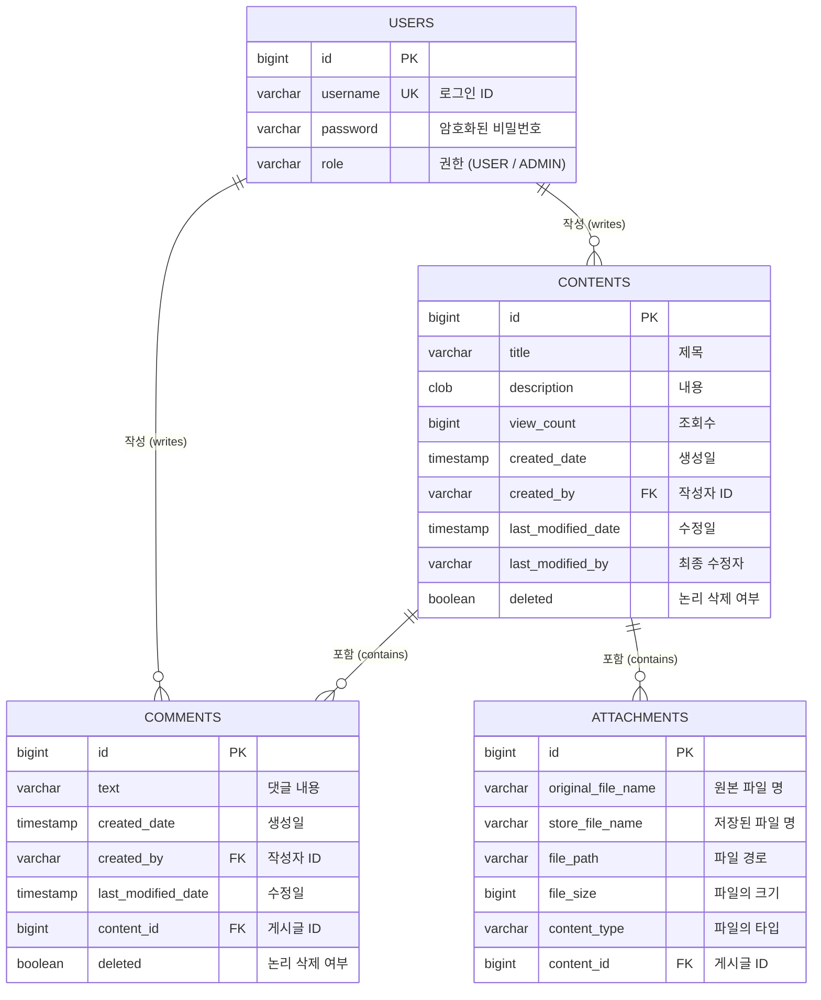

# 맑은기술 백엔드 개발자 코딩과제

## 1. 프로젝트 실행 방법

### QueryDSL QClass 생성 및 빌드
* IDE에서 Gradle 빌드 동기화를 수행합니다.
* 터미널 또는 Gradle 탭에서 아래 명령어를 실행하여 QClass를 생성합니다.
* `./gradlew clean compileJava`
* `build/generated/sources/annotationProcessor/java/main` 경로에 QClass 생성을 확인하고 필요 시 'Generated Sources Root'로 설정합니다.

### 애플리케이션 구동
* MalgnApplication.java를 실행하거나 아래 명령어를 입력합니다.
- `./gradlew bootRun`

---

## 2. ERD (데이터베이스 구조)

## 3. 구현 내용

### 기본 기능
* **콘텐츠 CRUD**
  - 콘텐츠 추가, 목록 조회(페이징), 상세 조회, 수정, 삭제 기능 구현
* **로그인 기능**
  - Spring Security 기반의 인증 시스템 구축
  - JWT와 쿠키(Cookie) 방식을 결합한 보안 및 사용자 인증 처리
* **사용자 Role**
  - 시스템 사용자를 ADMIN(관리자)과 USER(일반 사용자) 권한으로 구분하여 설계
* **접근 권한 정책**
  - 작성자 본인만 본인의 콘텐츠를 수정 및 삭제할 수 있도록 보안 로직 구현
  - ADMIN(관리자)은 모든 콘텐츠를 수정 및 삭제할 수 있도록 상위 권한 부여

### 추가 기능
* **동적 검색 기능 (QueryDSL)**
  - 제목, 내용, 작성자를 조합하여 검색할 수 있는 엔진 구축
* **Soft Delete**
  - 데이터의 물리적 삭제 대신 deleted 필드 상태를 변경하여 데이터 보존 및 복구 가능성 확보
* **관리자 페이지**
  - 일반 사용자는 접근할 수 없는 '삭제된 글 목록' 기능 구현
  - 삭제된 게시글을 다시 정상 상태로 되돌리는 '삭제 취소(복구)' 기능 구현
* **파일 첨부 기능**
  - multipart/form-data 형식을 지원하여 게시글과 함께 여러 개의 파일을 업로드할 수 있는 기능을 구현
  - WebMvcConfigurer를 통해 외부 경로의 파일을 정적 리소스로 매핑하여, 컨트롤러를 거치지 않고 고성능으로 이미지를 호출 가능
* **마이페이지 (내 글 보기)**
  - 현재 인증된 사용자가 작성한 게시글만 필터링하여 모아볼 수 있는 전용 API 제공
* **댓글 시스템**
  - 게시글 상세 조회 시 댓글 리스트 연동 및 조회 기능
  - 댓글 작성, 수정 및 Soft Delete 기반 삭제 로직 적용

---

## 4. API 문서화

* **Swagger (Springdoc OpenAPI)**
  - Swagger UI를 통해 실시간 API 테스트 및 파라미터 검증 가능
  - 접속 주소: `http://localhost:8888/swagger-ui/index.html` (서버 구동 시)

---

## 5. 사용한 AI 도구 또는 참고 자료

* **사용한 AI 도구**:
  - Google Gemini
  - 프론트 -> Codex

* **참고 자료**
  - 이전에 진행했던 프로젝트들
